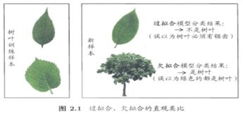
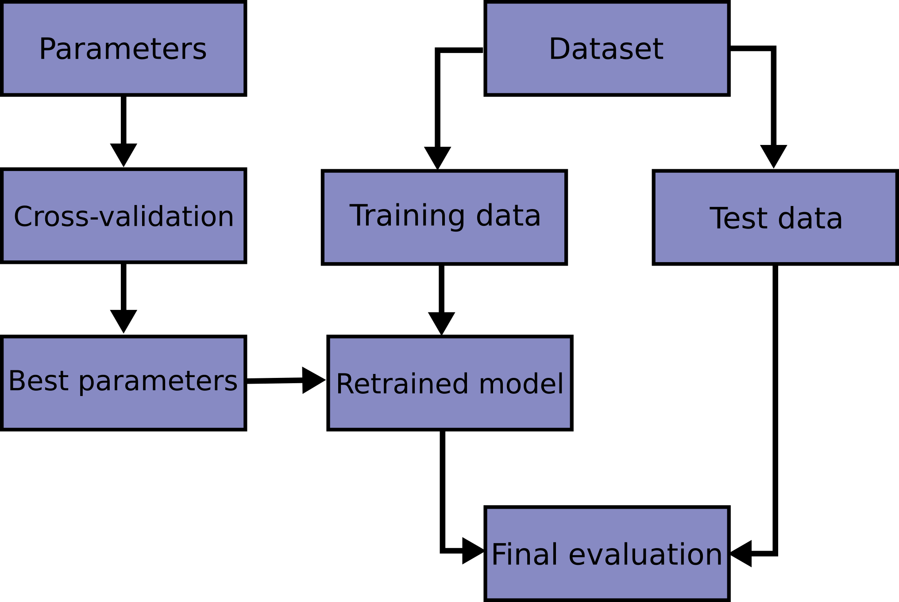
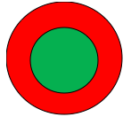
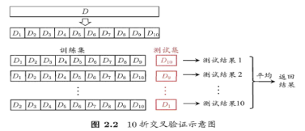
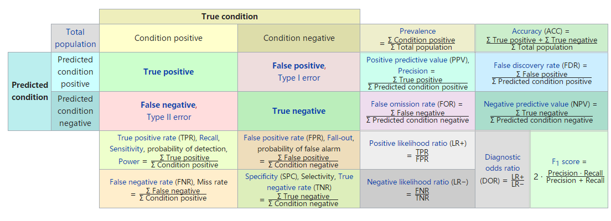
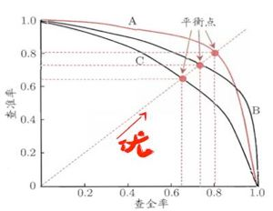
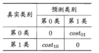
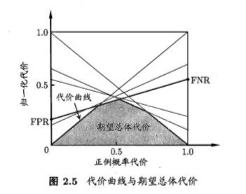

[TOC]

# 第一章 绪论

## 1.1 引言

​		机器学习是这样一门学科，它致力于研究如何通过计算的手段，利用经验来改善系统自身的性能,在计算机系统中，“经验”通常以“数据”形式存在，因此，机器学习所研究的主要内容，是关于在计算机上从数据中产生“模型” (model)的算法，即“学习算法” (learning algorithm)。有了学习算法，我们把经验数据提供给它，它就能基于这些数据产生模型；在面对新的情况时(例如看到一个没剖开的西瓜)，模型会给我们提供相应的判断(例如好瓜)。如果说计算机科学是研究关于“算法”的学问，那么类似的，可以说机器学习是研究关于“学习算法”的学问。

​		Mitchell 在1997给出了一个更形式化的定义：假设用 P 来评估计算机程序在某任务类 T 上的性能，若一个程序通过利用经验 E 在 T 中任务上获得了性能改善，则我们就说关于 T 和 P，该程序对 E 进行了学习。

## 1.2 基本术语

### 1.2.1 数据相关

* 示例/样本（instance / sample）

  例：（色泽=青绿；根蒂=蜷缩；敲声=浊响）

  一般以 $D={x_1,x_2, \dots , x_m}$ 表示包含 $m$ 个示例的数据集

* 数据集（data set）

  例：（色泽=青绿；根蒂=蜷缩；敲声=浊响），（色泽=乌黑；根蒂=稍蜷；敲声=沉闷），（色泽=浅白；根蒂=硬挺；敲声=清脆），……

* 属性/特征（attribute / feature）
  例：色泽、根蒂、敲声

  一个示例由 $d$ 个特征描述，如示例 $x_i=(x_{i1}；x_{i2}；\dots； x_{id})$ 
  
* 属性值（attribute value）
  例：青绿、乌黑、浅白

  如示例 $x_i=(x_{i1}；x_{i2}；\dots； x_{id})$ ，其中 $x_{id}$ 表示第 $i$ 个示例的第 $d$ 个特征的值
  
* 属性空间/样本空间/输入空间（attribute space / sample space）
  属性张成的空间称为“属性空间”（attribute space）、“样本空间”（sample space）或“输入空间”，例：我们把“色泽”、“根蒂”、“敲声”作为三个坐标轴，则它们张成一个用于描述西瓜的三维空间，每个西瓜都可在这个空间中找到自己的坐标位置。

* 特征向量（feature vector）
  在属性空间中的每个点对应一个坐标向量，因此我们也把一个示例 (instance/sample )称为一个“特征向量”（feature vector）

### 1.2.2 训练相关

* 学习/训练（learning / training）

  从数据中学得模型的过程称为“学习”（learning）或“训练”（training），这个过程通过执行某个学习算法来完成。

* 训练数据（training data）

  训练过程中使用的数据称为“训练数据”（training data）

* 训练样本（training sample）

  训练数据中每个样本称为一个“训练样本”（training sample）

* 训练集（training set）

  训练样本组成的集合称为“训练集”（training set）

* 假设与真相（hypothesis & ground-truth）

  + 假设：学得模型对应了关于数据的某种潜在的规律，因此亦称“假设”（hypothesis）

  + 真相：潜在规律自身，则称为“真相”或“真实”（ground-truth），学习过程就是为了找出或逼近真相
  + 两者区别：假设是我们认为的样本空间的真相，而样本空间的真相是客观存在的，我们认为的真相是否与真相本身相一致，需要后期的验证。

* 标记（label）

  训练样本的“结果”信息，例如“（色泽=青绿；根蒂=螺缩；敲声=浊响)，好瓜）”，这里关于示例结果的信息，例如“好瓜”，称为“标记”（label）

* 样例（example）

  拥有了标记信息的示例，称为“样例”（example）

* 标记空间/输出空间（label space）

  所有标记的集合，称为“标记空间”（label space）或“输出空间”

  

### 1.2.3 测试相关

* 分类（classification）

  若我们欲预测的是离散值，例如“好瓜”、“坏瓜”，此类学习任务称为“分类”（classification）

* 回归（regression）

  若欲预测的是连续值，例如西瓜成熟度0.95、0.37，此类学习任务称为“回归”（regression）

* 测试与测试样本（testing & testing sample）
  * 测试：学得模型后，使用其进行预测的过程称为“测试”（testing）
  * 测试样本：被预测的样本称为“测试样本”（testing sample）

* 簇&聚类（cluster & clustering）

  我们还可以对西瓜做“聚类”（clustering）：将训练集中的西瓜分成若干组，每组称为一个“簇”（cluster）；这些自动形成的簇可能对应一些潜在的概念划分，例如“浅色瓜”、“深色瓜”，甚至“本地瓜”、“外地瓜”。

  

  在聚类学习中，“浅色瓜”、“本地瓜”这样的概念我们事先是不知道的，而且学习过程中使用的训练样本通常不拥有标记信息。

* 监督学习与无监督学习的区别/分类
  + 监督学习（supervised learning）：训练数据有标记信息。如：分类、回归

  + 无监督学习（unsupervised learning）：训练数据无标记信息。如：聚类

    

### 1.2.4  泛化相关

* 泛化能力（generalization）

   学得模型适用于新样本的能力，称为“泛化”（generalization）能力

* 独立同分布（ i.i.d.）

  通常假设样本空间中全体样本服从一个未知“分布”（distribution）D，我们获得的每个样本都是独立地从这个分布上采样获得的，即“独立同分布”（independent and identically distributed，简称 i.i.d.），一般而言，训练样本越多，我们得到的关于 D 的信息越多，这样就越有可能通过学习获得具有强泛化能力的模型。

  > 中心极限定理：若样本的数据量足够大，样本均值近似服从正态分布。
  
  

## 1.3 假设空间

* 假设空间（hypothesis space）

  我们可以把学习过程看作一个在所有假设（hypothesis）组成的空间中进行搜索的过程，搜索目标是找到与训练集“匹配”（fit）的假设，即能够将训练集中的瓜判断正确的假设。

  

  假设的表示一旦确定，假设空间及其规模大小就确定了。

  

  附图
  
  

* 版本空间（version space）

  现实问题中我们常面临很大的假设空间，但学习过程是基于有限样本训练集进行的。因此，可能有多个假设与训练集一致，即存在着一个与训练集一致的“假设集合”，我们称之为“版本空间”（version space）。例如在西瓜问题中，与表1.1训练集所对应的版本空间如图1.2所示。

  
  
  附图
  
  

## 1.4 归纳偏好

* 归纳偏好（inductive bias）

   通过学习得到的模型对应了假设空间中的一个假设。机器学习算法在学习过程中对某种类型假设的偏好，称为“归纳偏好”（inductive bias），或简称为“偏好”。

  任何一个有效的机器学习算法必有其归纳偏好，否则它将被假设空间中看似在训练集上“等效”的假设所迷惑，而无法产生确定的学习结果。

  

* “奥卡姆剃刀”（Occam's razor）原则

  + 归纳偏好可看作学习算法自身在一个可能很庞大的假设空间中对假设进行选择的启发式或“价值观”，“奥卡姆剃刀”可以用来引导算法确立“正确的”偏好。
  + “奥卡姆剃刀”（Occam's razor）原则：若有多个假设与观察一致，则选最简单的那个

* 什么学习算法更好

  归纳偏好对应了学习算法本身所做出的关于“什么样的模型更好”的假设，在具体的现实问题中，这个假设是否成立，即算法的归纳偏好是否与问题本身匹配，大多数时候直接决定了算法能否取得好的性能。
  对于一个学习算法A，若它在某些问题上比学习算法B好，则必然存在另一些问题，在那里B比A好。**这个结论对任何算法均成立**

  + “没有免费的午餐”定理（NFL定理）

    无论学习算法A多聪明，学习算法B多笨拙，它们的期望性能相同。这就是“没有免费的午餐”定理（No Free Lunch Theorem，简称NFL定理）

    NFL定理有一个重要前提：所有“问题”出现的机会相同、或所有问题同等重要，但实际情形并不是这样。例如：“(根蒂=蝶缩;敲声=浊响)”的好瓜很常见，而“(根落二硬摄:敲声二清晚)”的好瓜罕见，甚至不存在。

    NFL定理最重要的寓意：脱离具体问题，空泛地谈论“什么学习算法更好”毫无意义。**要谈论算法的相对优劣，必须要针对具体的学习问题。**学习算法自身的归纳偏好与问题是否相配，往往会起到决定性的作用。

    

## 1.5 发展历程

​	略

##  1.6 应用现状

​	略

## 1.7 阅读材料

​	可以参考 [Roadmap](../Roadmap.md)中的相关资源

## 1.8 第1章习题

​	略

## 小故事：“机器学习”名称的由来

​    1952年，阿瑟·萨缪尔(Arthur Samuel， 1901-1990) 在IBM公司研制了一个西洋跳棋程序，这个程序具有自学习能力，可通过对大量棋局的分析逐渐辨识出当前局面下的“好棋”和“坏棋”，从而不断提高弈棋水平，并很快就赢了萨缪尔自己。 1956年，萨缪尔应约翰·麦卡锡(John McCarthy， “人工智能之父” ， 1971年图灵奖得主)之邀，在标志着人工智能学科诞生的达特茅斯会议上介绍这项工作，萨缪尔发明了“机器学习”这个词，将其定义为“不显式编程地赋予计算机能力的研究领域” 。他的文章"Some studies in machine learning using the game of checkers" 1959年在IBM Journal正式发表后，爱德华·费根鲍姆(Edward Feigenbaum，“知识工程之父” ，1994年图灵奖得主)为编写其巨著Computers and Thought，在1961年邀请萨缪尔提供一个该程序最好的对弈实例，于是，萨缪尔借机向康涅狄格州的跳棋冠军、当时全美排名第四的棋手发起了挑战，结果萨缪尔程序获胜，在当时引起表动。
​    事实上，萨缪尔跳棋程序不仅在人工智能领域产生了重大影响，还影响到整个计算机科学的发展，早期计算机科学研究认为，计算机不可能完成事先没有显式编程好的任务，而萨缪尔跳棋程序否证了这个假设，另外，这个程序是最早在计算机上执行非数值计算任务的程序之一，其逻辑指令设计思想极大地影响了IBM计算机的指令集，并很快被其他计算机的设计者采用。

# 第二章 模型评估与选择

## 2.1 经验误差与过拟合

### 2.1.1 概念解析

(1)  误差：学习器的实际预测输出与样本的真实输出之间的差异；其中学习器在训练集上的误差称为”**训练误差**“（training error）或“**经验误差**” （empirical error），在新样本上的误差称为”**泛化误差**“（generalization error）。值得一提的是，学习器就是在训练集上训练出来的，但实际上在回到训练集上对样本预测结果时，仍有误差。（即结果值与标记值不同）

(2)     错误率：分类错误的样本数占样本总数的比例，$E=\frac{a}{m}$（ $a$ 个样本错误，$m$ 个样本总数）

(3)     精度：与错误率的概念相反，$P=(1-E)\ast 100\%$ 

(4)     过拟合(overfitting)：学习器学习的”太好了“，把训练样本自身的特点当作了所有潜在样本都会有的一般性质。（注意：过拟合会造成泛化性能下降）

(5)     欠拟合(underfitting)：对训练样本的性质尚未学好

### 2.1.2 注意事项

（1）泛化误差

我们一直希望得到泛化误差最小的学习器。但是我们实际能做的就是努力使经验误差最小化。注意：努力使经验误差最小化≠让经验误差达到最小值，即训练集的分类错误率为 0%。因为在训练集上表现很好的学习器，泛化能力却并不强。

（2）欠拟合与过拟合

欠拟合比较容易克服，往往因为学习器学习能力过强造成的过拟合较难处理，但是实际上过拟合是机器学习过程中必须面对的障碍。我们必须认识到过拟合我们无法彻底避免，我们只能尽可能”缓解“。从理论上讲，机器面临的问题通常是 NP 难或者更难，而有效的学习算法是在多项式时间内完成的，若可以彻底避免过拟合，则通过经验误差最小化就获得最优解，那么我们构造性的证明了 P=NP，但实际上 P≠NP，也就是说这是不可能完成的。

## 2.2 评估方法（数据集划分方法）

在现实任务中，我们往往有多种学习算法可供选择，甚至对同一个学习算法，当使用不同的参数配置时，也会产生不同的模型，那么，我们该选用哪一个学习算法、使用哪一种参数配置呢? 这就是机器学习中的“模型选择” (model selection)问题，理想的解决方案当然是对候选模型的泛化误差进行评估，然后选择泛化误差最小的那个模型，然而如上面所讨论的，我们无法直接获得泛化误差而训练误差又由于过拟合现象的存在而不适合作为标准。

因此，通常，我们需要通过实验测试来对学习器的泛化误差进行评估从而做出选择。此时，我们需要一个“测试集”来测试学习器对新样本的判别能力，然后以测试集上的“测试误差”作为泛化误差的近似。（假设测试样本独立同分布）我们知道一个 $m$ 个样例的数据集 $D={(x_1,y_1),(x_2,y_2),\dots,(x_m,y_m)}$ ,我们要对这个数据集既要训练又要测试，那么如何产生训练集 $S$ 和测试集 $T$ 是我们要面对的问题。

### 2.2.1 留出法 LOO
留出法 Leave-one-out：直接将数据集 $D$ 划分为两个互斥的集合，其中一个集合作为训练集 $S$ ，另一个作为测试集 $T$，即 $D=S\cup T$，$S\cap T= \emptyset$。

如上图所示，两个同心圆。其中内圆红色部分为训练集，外环绿色部分为测试集，两部分是两个互斥的集合。

除此之外，留出法还要尽可能的保持数据分布的一致性，要保持样本类别比例相似，从采样的角度看待数据采集的划分过程，保留类别比例的采样方式通常称为“分层采样”。

就好比它真是一个西瓜，按甜度将其分为七块，采样时每一块都要按照相同的所占比例去采。这七类数据集的测试集与训练集的比值应是相等的。

.png)

注意：单次使用留出法所得到的估计结果往往不稳定可靠，在使用留出法时，一般采用若干次随机划分、重复实验取平均值。

留出法的特点：
1. 直接划分训练集与测试集；
2. 训练集和测试集采取分层采样；
3. 随机划分若干次，重复试验取平均值

### 2.2.2 交叉验证 CV
交叉验证法 cross-validation：先将数据集 $D$ 分为 $k$ 个大小相似的互斥子集，即 $D=D_1\cup D_2\cup \dots \cup D_k ；D_i \cap D_j = \emptyset（i \neq j）$。每个子集 $D_i$ 都尽可能保持数据分布的一致性，即每个子集仍然要进行分层采样。每次用 $k-1$ 个子集作为训练集，余下作测试集，这样可以获得 $k$ 组“训练/测试集”，最终返回的是 $k$ 个结果的均值。

与留出法类似，将数据集 $D$ 划分为 $K$ 个子集同样存在多种划分方式。为减少因样本划分不同而引入的差别，$k$ 折交叉验证通常也要重复 $p$ 次实验，最后取均值。

**交叉验证的特例：**

留一法（LOO）：$m$ 个样本划分成 $m$ 个子集，每个子集包含一个样本。留一法中被实际评估的模型与期望评估的用 $D$ 训练出来的模型很相似，因此，留一法的评估结果往往被认为比较准确。

留一法缺陷：当数据集过大时，计算开销、时间开销、空间开销都是难以忍受的（还未考虑算法调参）。

### 2.2.3 自助法 bootstrapping	
留出法与交叉验证法都会使训练集比 $D$ 小，这必然会引入一些因样本规模不同而导致的估计偏差。那么如何做到较少训练样本规模不同造成的影响，同时还高效地进行实验估计呢？

自助法 bootstrapping：对有 $m$ 个样本的数据集 $D$，按如下方式采样产生数据集 $D^\prime$：每次随机取一个样本拷贝进$D^\prime$，取 $m$ 次（有放回取 $m$ 次）。

按此方法，保证了 $D^\prime$ 和 $D$ 的规模一致。但 $D^\prime$ 虽然也有 $m$ 个样本，其中会出现重复的样本，$D$中会存在  $D^\prime$ 没有采到的样本，这些样本就留作测试集。

计算某样本在 $m$ 次采样中均不会被采到的概率是： $(1-\frac{1}{m})^m$ ，取极限可得
$$
\lim_{m\to \infty}(1-\frac{1}{m})^m \to \frac{1}{e} \approx 0.368
$$
由此可知，理论上有36.8%的样本没有出现在在$D^\prime$ 之中，我们把 $D \setminus D^\prime$ 作为测试集。

优点：训练集与数据集规模一致；数据集小、难以有效划分训练/测试集时效果显著；能产生多个不同的训练集；

缺点：改变了训练集的样本分布，引入估计偏差。

### 2.2.4 调参与最终模型

大多数学习算法都有些参数 (parameter) 需要设定，参数配置不同，学得模型的性能往往有显著差别，因此，在进行模型评估与选择时，除了要对适用学习算法进行选择，还需对算法参数进行设定，这就是通常所说的“参数调节”或简称“调参” (parameter tuning)。

因为学习算法的参数可能是在实数域，因此对每种参数配置都训练相应的模型成为了不可行方案，通常我们对每个参数选定一个**范围**和**变化步长**，显然，这样选定的参数值往往不是“最佳”值，但这是在计算开销和性能估计之间进行折中的结果，通过这个折中，学习过程才变得可行，

给定包含 $m$ 个样本的数据集 $D$，在模型评估与选择过程中由于需要留出一部分数据进行评估测试，事实上我们只使用了一部分数据训练模型，因此，在模型选择完成后，学习算法和参数配置已选定，此时应该用数据集 $D$ **重新训练模型**，这个模型在训练过程中使用了所有 $m$ 个样本，这才是我们最终提交给用户的模型。	

另外，需注意的是，我们通常把学得模型在实际使用中遇到的数据称为测试数据，为了加以区分，模型评估与选择中用于评估测试的数据集常称为“验证集” (validation set)。例如，在研究对比不同算法的泛化性能时，我们用测试集上的判别效果来估计模型在实际使用时的泛化能力，而把训练数据另外划分为训练集和验证集，基于验证集上的性能来进行模型选择和调参。

（1）概念详解
+ 调参 parameter tunning：对模型进行评估和选择时，对算法参数 parameter 进行标定。
+ 验证集 validation set：模型评估与选择中用于评估测试的数据集。

（2）参数的分类
- 算法的参数：亦称超参数，数目在十以内
- 模型的参数：数目众多。

## 2.3 性能度量

对学习器的泛化性能进行评估，不仅需要有效可行的实验估计方法，还需要**衡量模型泛化能力的评价标准**，即性能度量 performance measure。不同的性能度量，模型的好坏也不同，故模型的好坏是相对的。它取决于三个方面：

- 算法（算法类型+ 参数）
- 数据情况
- 任务需求
  - 原型设计阶段：离线评估 Offline evaluation
  - 应用阶段：在线评估 Online evaluation , 一般使用商业评价指标

>通常机器学习过程包括两个阶段,原型设计阶段和应用阶段

>原型设计阶段是使用历史数据训练一个适合解决目标任务的一个或多个机器学习模型，并对模型进行验证( Validation )与离线评估( Offline evaluation )，然后通过评估指标选择一个较好的模型。比如准确率( accuracy )、精确率-召回率( precision-recall)等

>应用阶段是当模型达到设定的指标值时便将模型上线,投入生产,使用新生成的数据来对该模型进行在线评估( Online evaluation ),以及使用新数据更新模型。在线评估中，一般使用一些商业评价指标,如用户生命周期价值( Customer Lifetime Value, CLV )、广告点击率(ClickThrough Rate, CTR)、用户流失率( Customer Churn Rate, CCR)等,这些指标才是模型使用者最终关心的一些指标。

预测任务中，给定样例数据集 $D={(x_1,y_1),(x_2,y_2),\dots,(x_m,y_m)}$ ，其中  $y_i$ 是示例 $x_i$ 的真实标记。 评估学习器 $f$ 的性能，需要将学习器的预测结果 $f(x)$ 同真实标记 $y$  进行比较。

本节内容，原书都以分类任务的常用性能度量为例。

### 2.3.1 错误率与精度

错误率 error rate：
$$
E(f ; D)=\frac{1}{m} \sum_{i=1}^{m} \mathbb{I}\left(f\left(\boldsymbol{x}_{i}\right) \neq y_{i}\right)
$$
其中 $\mathbb{I}(f(x_i)\neq y_i)$ 为指示函数 indicator function ，若表达式为真则取值为1，否则取值0

精度 accuracy：
$$
\begin{aligned} \operatorname{acc}(f ; D) &=\frac{1}{m} \sum_{i=1}^{m} \mathbb{I}\left(f\left(\boldsymbol{x}_{i}\right)=y_{i}\right) \\ &=1-E(f ; D) \end{aligned}
$$

更一般的，对于数据分布 $\mathcal{D}$ 和概率密度函数 $\mathcal{p}(\cdot)$ ，错误率和精度可分别描述为

[comment]: 后续需要补充说明

$$
E(f ; \mathcal{D})=\int_{\boldsymbol{x} \sim \mathcal{D}} \mathbb{I}(f(\boldsymbol{x}) \neq y) p(\boldsymbol{x}) \mathrm{d} \boldsymbol{x} \tag{2.6}
$$

$$
\begin{aligned} \operatorname{acc}(f ; \mathcal{D}) &=\int_{\boldsymbol{x} \sim \mathcal{D}} \mathbb{I}(f(\boldsymbol{x})=y) p(\boldsymbol{x}) \mathrm{d} \boldsymbol{x} \\ &=1-E(f ; \mathcal{D}) \end{aligned} \tag{2.7}
$$

### 2.3.2 查准率、查全率与F1（混淆矩阵）

当需要反映的不是判断正确与否的能力，而是正例、反例查出的准确率时，就不能用错误率和精度作为判断分类任务模型的性能度量了，查准率（准确率） precision 和查全率（召回率） recall 应运而生。（因为各个翻译版本的不同，下文都以英文表示）

为了说明 precision 和 recall，我们引入混淆矩阵 confusion matrix。可以说，confusion matrix 很直观地表示了各个指标的定义、来源以及作用意义。

以 [维基百科](https://en.wikipedia.org/wiki/Confusion_matrix) 给出的表格释义最为直观与全面

其中，True condition 表示数据集中各数据样本的真实标记值，一般即为 $y$ ，Predicted condition 表示学习算法给出的预测值。

> True positive (TP)：真正例，即真实值为1，预测为1

> False positive (FP)：假正例，即真实值为0，预测为1

> False negtive (FN)：假反例，即真实值为1，预测为0

> True negtive (TN):  真反例，即真实值为0，预测为0

有了confusion matrix ，我们就可以很直观地知道其他指标的定义了

> precision(Positive predictive value,PPV) ：预测为正例的样本中真正例的比例
> $$
> \text{Precision} = \frac{\sum \text { True positive }}{\sum \text { Predicted condition positive }}=\frac{\text{真正例=TP}}{\text{预测为正例=TP+FP}}
> $$

> Recall(True positive rate, TPR, Sensitivity) ：真实值为正例中被预测为正例的比例
> $$
> \text{Recall}=\frac{\sum \text { True positive }}{\sum \text { Condition positive }} = \frac{\text {真正例=TP}}{\text {真实值为正例=TP+FN}}
> $$
> 

可以发现，**precision 反映准确性，recall 反映全面性，**他们是一对矛盾的存在。为了找到 P、R之间的平衡点，我们将以 precision 为纵轴，recall 为横轴，建立直角坐标系，就得到”P-R“图

根据 P-R 曲线，我们就可以去评价学习器性能的优劣

* 当曲线没有交叉的时候：外侧曲线的学习器性能优于内侧；
* 当曲线有交叉的时候（此时无法根据 P-R 图得到哪个学习器更优，需要在具体情境下比较）：
  * 比较曲线下面积（值不容易计算）
  * 比较两条曲线的平衡点 Break-Even Point (BEP)，平衡点是“precision=recall”时的取值，在上图中表示为曲线和对角线的交点，平衡点在外侧的曲线的学习器性能优于内侧
  * $F1$ 度量和 $F_{\beta}$度量。$F1$ 是基于查准率与查全率的调和平均 harmonic mean ，$F_{\beta}$ 则是加权调和平均

> $$
> \frac{1}{F 1}=\frac{1}{2} \cdot\left(\frac{1}{P}+\frac{1}{R}\right) \Rightarrow F1=\frac{2\times P \times R}{P+R} = \frac{2\times TP}{\text{样例总数}+TP-TN}
> $$

> $$
> \frac{1}{F_{\beta}}=\frac{1}{1+\beta^{2}} \cdot\left(\frac{1}{P}+\frac{\beta^{2}}{R}\right) \Rightarrow F_{\beta} = \frac{(1+\beta ^{2})\times P \times R}{(\beta ^{2}\times P)+ R}
> $$

其中， $\beta \gt 0$ 度量了recall 对 precision 的相对重要性，$\beta = 1$ 时 $F_{\beta}$ 退化为标准 $F1$ ， $\beta \gt 1$ 时 recall 有更大影响，反之，precision 有更大影响。

对于我们有多个二分类混淆矩阵的情况，例如进行多次训练/测试，每次得到一个混淆矩阵；或是在多个数据集上进行训练/测试，希望估计学习算法的“全局”性能；甚或是执行多分类任务，每两两类别的组合都对应一个混淆矩阵……总之，我们希望在n个二分类混淆矩阵上综合考察查准率 precision 和查全率recall，于是就有了宏查准率 （macro-P）、 宏查全率（macro-R）、宏F1（macro-F1）以及微查准率 （micro-P）、 微查全率（micro-R）、微F1（micro-F1）

宏 macro ：在 n 个混淆矩阵中分别计算出 precision、recall，再计算均值，就得到“宏查准率, macro-P”、“宏查全率, macro-R ”和“宏F1, macro-F1”

> $$
> macro\mathbb{-}P=\frac{1}{n} \sum_{i=1}^{n} P_{i} \quad macro\mathbb{-}R=\frac{1}{n} \sum_{i=1}^{n} R_{i} \quad macro\mathbb{-}F1=\frac{2\times macro\mathbb{-}P \times macro\mathbb{-}R}{macro\mathbb{-} P + macro\mathbb{-} R}
> $$

微 micro ：先将n个混淆矩阵的对应元素 $TP,  FP, TN, FN$ 进行平均得到 $\overline{TP}, \overline{FP}, \overline{TN}, \overline{FN}$，再计算precison, recall 和 F1，就得到“微查准率，micro-P”、“微查全率，micro-R”和 “微F1，micro-F1”。
$$
micro\mathbb{-}P=\frac{\overline{TP}}{\overline{TP}+\overline{FP}} \quad micro\mathbb{-}R=\frac{\overline{TP}}{\overline{TP}+\overline{FN}} \quad micro\mathbb{-}F1=\frac{2\times micro\mathbb{-}P \times micro\mathbb{-}R}{micro\mathbb{-} P + micro\mathbb{-} R}
$$

[comment]:   macro-F1和micro-F1应用场景的区别？

### 2.3.3 ROC与AUC

很多学习器是为测试样本产生一个实值或概率预测，然后将这个预测值与一个分类阈值(threshold)进行比较，若大于阔值则分为正类，否则为反类。例如，神经网络在一般情形下是对每个测试样本预测出一个[0.0，1.0]之间的实值，然后将这个值与 0.5 进行比较，大于 0.5 则判为正例，否则为反例，这个实值或概率预测结果的好坏，直接决定了学习器的泛化能力，实际上，根据这个实值或概率预测结果，我们可将测试样本进行排序， “最可能”是正例的排在最前面，“最不可能”是正例的排在最后面，这样，分类过程就相当于在这个排序中以某个“截断点” (cut point)将样本分为两部分，前一部分判作正例，后一部分则判作反例

在不同的应用任务中，我们可根据任务需求来采用不同的截断点，例如若我们更重视precision，则可选择排序中靠前的位置进行截断；若更重视 recall，则可选择靠后的位置进行截断，因此，**排序本身的质量好坏**，体现了综合考虑学习器在不同任务下的**期望泛化性能**的好坏，或者说， “一般情况下”泛化性能的好坏。 ROC曲线（Receiver Operating Characteristic curve）则是从这个角度出发来研究学习器泛化性能的有力工具。

ROC 名为”受试者工作特征“曲线，源于二战中用于敌机检测的雷达信号分析技术。与之前的P-R曲线相似，需要对样例进行排序，然后按顺序逐个将样本作为正例进行预测。ROC曲线以真正例率（TPR，即Recall）为纵轴，假正例率（FPR）为横轴，ROC曲线下的面积为AUC（Area Under ROC Curve）

> $$
> TPR = Recall = \frac{\sum \text{True positive}}{\sum \text{Condition positive}}=\frac{TP}{TP+FN}
> $$

真正例率（TPR）：【真正例样本数】与【真实情况是正例的样本数】的比值。反映预测正类中实际正类越多

> $$
> FPR = \frac{\sum \text{False positive}}{\sum \text{Condition negtive}}=\frac{FP}{FP+TN}
> $$

假正例率（FPR）：【假正例样本数】与【真实情况是反例的样本数】的比值。反映预测正类中实际负类越多

如图，理想模型是真正例率为100%，假正例率为 0% 的一点（左上角）。随机猜测模型则是真正例率与假正例率持平的直线。对角线对应于“随机猜测”模型,而点(0, 1)则对应于将所有正例排在所有反例之前的“理想模型”。

然而，现实任务中通常是利用**有限个**测试样例来绘制 ROC 图，此时仅能获得有限个(真正例率，假正例率)坐标对，ROC曲线绘图过程很简单：给定m+ (即 Condition positive)个正例和 m- (即Condition negtive)个反例，根据学习器预测结果对样例进行排序，然后把分类阈值设为最大，即把所有样例均预测为反例，此时真正例率和假正例率均为0，在坐标 (0,0) 处标记一个点，然后，将分类阈值依次设为每个样例的预测值（从大到小）,即依次将每个样例划分为正例，设前一个标记点坐标为 $(x,y)$ 当前若为真正例，则对应标记点的坐标为 $(x, y+\frac{1}{m+} )$ 当前若为假正例，则对应标记点的坐标为$(x+\frac{1}{m-}, y)$ 然后用线段连接相邻点即得。

**利用ROC曲线比较学习器的性能优劣**

* 若一个学习器的ROC曲线被另一个学习器的曲线完全“包住” ，则可断言后者的性能优于前者
* 若两个学习器的ROC曲线发生交叉，则难以一般性地断言两者孰优孰劣，此时如果一定要进行比较，则较为合理的判据是比较ROC曲线下的面积，即AUC

从定义可知，AUC可通过对ROC曲线下各部分的面积求和而得，假定ROC曲线是由坐标为${(x_1,y_1), (x_2, y_2),\dots, (x_m,y_m)}$ 的点按序连接而形成 $(x_1=0, x_m=1)$ ，则AUC可估算为
$$
AUC=\frac{1}{2} \sum_{i=1}^{m-1}\left(x_{i+1}-x_{i}\right) \cdot\left(y_{i}+y_{i+1}\right)
$$
这里的估算方式实际上是使用了梯形公式（$(\text{上底+下底})\times \text{高} \times \frac{1}{2}$），其中 $x_{i+1}-x_i$ 为高，$y_i, y_{i+1}$ 分别为上底和下底，更详细的解析可以参考[南瓜书](https://datawhalechina.github.io/pumpkin-book/#/chapter2/chapter2)

AUC 指标用来评估分类器性能，可以兼顾**样本中类别不平衡**的情况（当测试集中的正负样本的分布变化的时候，ROC曲线能够保持不变），这一点上要比分类准确率更加具有参考价值。

**AUC的一般判断标准**
* 0.5 - 0.7：效果较低
* 0.7 - 0.85：效果一般
* 0.85 - 0.95：效果很好
* 0.95 - 1：效果非常好，但一般不太可能

整体而言，混淆矩阵给我们呈现了一个清晰可见的分类模型效果评估工具，而基于混淆矩阵的评估指标可以从不同侧面来评价分类器性性能，至于在实际操作中使用什么样的评估指标来进行评价，还要视具体的分析目标而定。

可参考的说明网站 [网站1](http://alexkong.net/2013/06/introduction-to-auc-and-roc/) , [网站2](https://www.cnblogs.com/dlml/p/4403482.html)

### 2.3.4 代价敏感错误率与代价曲线

从混淆矩阵中我们可以看到，存在两种错判的情况（FP 为 1型错误，FN为 2型错误），在前面介绍的性能度量标准下，它们都隐式地假设了均等代价（两种错判情况造成影响相等），然而，两种错误类型会造成的后果（错误代价）是不一致的。

例如在医疗诊断中，错误地把患者诊断为健康人与错误地把健康人诊断为患者，看起来都是犯了“一次错误” ，但后者的影响是增加了进一步检查的麻烦，前者的后果却可能是丧失了拯救生命的最佳时机；再如，门禁系统错误地把可通行人员拦在门外，将使得用户体验不佳，但错误地把陌生人放进门内，则会造成严重的安全事故。

为权衡不同类型错误所造成的不同损失，为错误赋予“非均等代价”（unequal cost）。在非均等代价下，目标不再是简单地最小化错误次数，而是最小化总体代价 total cost 。

实现方式是，可根据任务的领域知识设定代价矩阵 cost matrix

其中 $cost_{ij}$ 表示将第 $i$ 类样本预测为第 $j$ 类样本的代价。一般来说, $cost_{01}$ 就对应于第一类错误，$cost_{10}$ 就对应于第二类错误。如上图所示，第1类作为正类、第0类作为反类，令 $D+$ 与 $D-$ 分别代表样例集 $D$ 的正例子集和反例子集，则“代价敏感” (cost-sensitive)错误率为
$$
\begin{aligned} 
E(f ; D ; cost)=& \frac{1}{m}\left(\sum_{x_{i} \in D^{+}} \mathbb{I}\left(f\left(\boldsymbol{x}_{i}\right) \neq y_{i}\right) \times cos t_{01}\right.\\ &+\sum_{\boldsymbol{x}_{i} \in D^{-}} \mathbb{I}\left(f\left(\boldsymbol{x}_{i}\right) \neq y_{i}\right) \times cost_{10} ) \end{aligned}
$$

类似的，可给出基于分布定义的代价敏感错误率，以及其他一些性能度量如精度（precision）的代价敏感版本，若令 $cost_{ij}$ 中的 $i,  j$ 取值不限于0、1,则可定义出多分类任务的代价敏感性能度量。

在非均等代价下, ROC曲线不能直接反映出学习器的期望总体代价，而“代价曲线” (cost curve)则可达到该目的，代价曲线图的横轴是取值为 [0,1] 的正例概率代价， 纵轴是取值为 [0,1] 的归一化代价
$$
P(+)\text{cost}=\frac{p \times \text{cost}_{01}}{p \times \text{cost}_{01}+(1-p) \times \text{cost}_{10}}
$$

$$
\text{cost}_\text{norm}=\frac{FNR \times p \times \text{cost}_{01}+FPR \times(1-p) \times \text{cost}_{10}}{p \times \text{cost}_{01}+(1-p) \times \text{cost}_{10}}
$$

其中 FPR 是假正例率，FNR=1-TPR是假反例率，代价曲线的绘制很简单: ROC曲线上每一点对应了代价平面上的一条线段，设ROC曲线上点的坐标为(TPR, FPR)，则可相应计算出 FNR ，然后在代价平面上绘制一条从 (0, FPR) 到(1, FNR) 的线段，线段下的面积即表示了该条件下的期望总体代价；如此将ROC曲线上的每个点转化为代价平面上的一条线段，然后**取所有线段的下界**，围成的面积即为在所有条件下学习器的期望总体代价

### 2.3.5 sklearn中的分类算法性能度量实现

[comment]:  <后续补充>

## 2.4 比较检验

有了实验评估方法和性能度量，看起来就能对学习器的性能进行评估比较了：先使用某种实验评估方法测得学习器的某个性能度量结果，然后对这些结果进行比较，但怎么来做这个“比较”呢？是直接取得性能度量的值然后“比大小”吗？

实际上，机器学习中性能比较这件事要复杂得多。这里面涉及几个重要因素：

- 我们希望比较的是泛化性能，然而通过实验评估方法我们获得的是测试集上的性能，两者的对比结果可能未必相同；
- 测试集上的性能与测试集本身的选择有很大关系，且不论使用不同大小的测试集会得到不同的结果，即便用相同大小的测试集，若包含的测试样例不同，测试结果也会有不同；
- 很多机器学习算法本身有一定的随机性，即便用相同的参数设置在同一个测试集上多次运行，其结果也会有不同

统计假设检验(hypothesis test)为我们进行学习器性能比较提供了重要依据，基于假设检验结果我们可推断出，若在测试集上观察到学习器 A 比 B 好，则A的泛化性能是否在统计意义上优于B，以及这个结论的把握有多大。

[comment]: 后续再补充

## 2.5 偏差与方差

[comment ]: <后续补充>